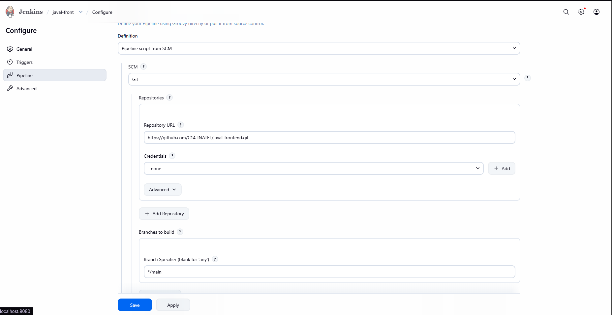
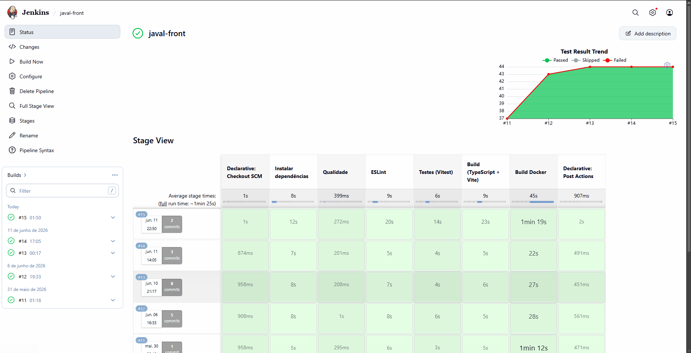
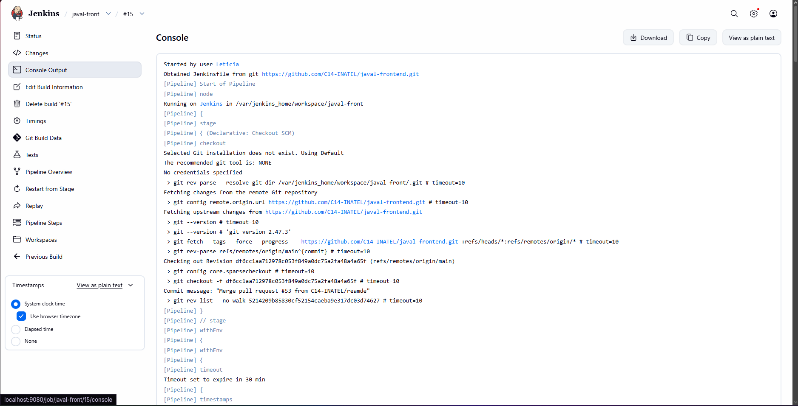
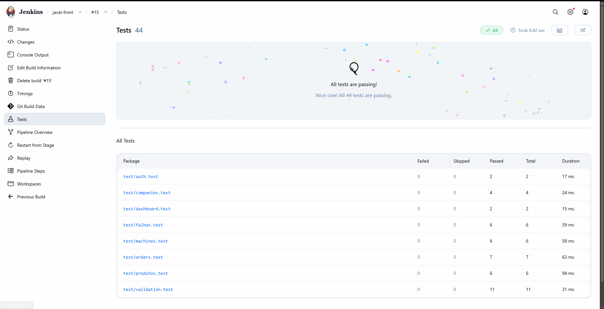

# CI/CD — Pipeline Jenkins (JAVAL Frontend)

Documentação dedicada à **configuração** e às **evidências de execução** da pipeline de CI/CD do repositório [javal-frontend](https://github.com/C14-INATEL/javal-frontend). Para o projeto em geral (execução local, Docker, histórias de usuário, etc.), consulte o [README principal](README.md) na raiz do repositório.

---

## Ferramenta utilizada

A pipeline foi implementada com **Jenkins**, executando localmente via **Docker** ([`Dockerfile.jenkins`](Dockerfile.jenkins) + serviço `jenkins` no [`docker-compose.yml`](docker-compose.yml)).

---

## O que a pipeline executa

### Etapas

| Etapa | Descrição |
|-------|-----------|
| Instalar dependências | Instalação com `npm ci` |
| ESLint | Verificação de qualidade com `npm run lint` (em **paralelo** com os testes) |
| Testes (Vitest) | Testes unitários com `npm run test` |
| Build (TypeScript + Vite) | Compilação e bundle de produção com `npm run build` (saída em `/dist`) |
| Build Docker | Imagem `javal-frontend:prod` com `docker build -t javal-frontend:prod .` |

### Stages do pipeline (resumo)

| Stage | O que faz |
|---|---|
| Checkout SCM | Clona o repositório |
| Instalar dependências | `npm ci` |
| ESLint | Verifica qualidade do código |
| Testes (Vitest) | Roda os 44 testes unitários |
| Build (TypeScript + Vite) | Compila e gera o `/dist` |
| Build Docker | Gera a imagem `javal-frontend:prod` |

Os blocos `post` do [`Jenkinsfile`](Jenkinsfile) exibem mensagens de **sucesso** ou **falha** no console ao final de cada estágio relevante.

---

## Definição do pipeline

O pipeline está definido no [`Jenkinsfile`](Jenkinsfile) na raiz do projeto e é executado a cada push no repositório (ou conforme o agendamento / webhooks configurados no Jenkins).

---

## Configuração

- **Repositório:** `https://github.com/C14-INATEL/javal-frontend.git`
- **Branch:** `main`
- **Script Path:** `Jenkinsfile`
- **Agente Jenkins:** imagem customizada (`Dockerfile.jenkins`) com **Node.js 20**, **Docker CLI** e plugins de pipeline; a imagem base do Jenkins inclui **JDK 21** (LTS)

---

## Como reproduzir localmente

1. Na **raiz do repositório**, subir o Jenkins (e outros serviços, se quiser) com Docker Compose:
   ```bash
   docker compose build
   docker compose up -d
   ```
2. Acessar **`http://localhost:9080`** (mapeamento `9080 → 8080` no container).
3. Criar um item do tipo **Pipeline**.
4. Em **Pipeline script from SCM**, apontar para o repositório e branch acima e definir **Script Path** como `Jenkinsfile`.
5. Executar **Build Now** (ou acionar por webhook, conforme a sua configuração).

---

## Como configurar o job (resumo)

1. Acessar **http://localhost:9080**
2. Criar um job **Pipeline → Pipeline script from SCM**
3. Apontar para este repositório
4. **Script Path:** `Jenkinsfile`

---

## Evidências de execução

### Configuração da pipeline (SCM)

A pipeline está configurada para obter o código do repositório **C14-INATEL/javal-frontend**, branch **`main`**, lendo o **`Jenkinsfile`** versionado no projeto.



### Stage View — stages concluídos com sucesso

Visão geral da execução: dependências, qualidade (ESLint e testes em paralelo), build e imagem Docker finalizados com sucesso.



### Console Output — finalização da pipeline

Trecho do log de console mostrando o encerramento da build (incluindo resumo `post` da pipeline).



### Testes no Jenkins (print)

Evidência de que o stage de testes (Vitest) concluiu com sucesso na interface do Jenkins.



---

## Imagens

Todas as capturas estão na pasta [`docs/images/`](docs/images/).
